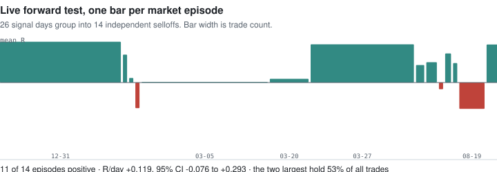

# Oversold Breadth Monitor

**A mean-reversion rule for US equities, running live and logging every decision in public.**

When the broad market sells off — not one company, the whole tape — stocks in long-term
uptrends tend to bounce within a couple of days. This tracks that, on 1,500 US names, and
publishes what it finds every trading day.

**→ [Live monitor](https://dima252.github.io/Stock_prediction_model/docs/)** — today's market state, rebuilt nightly

---

## The rule

```python
(dist_sma200_atr > 0)          # the stock's long-term uptrend is intact
& (oversold_breadth > 0.20)    # the WHOLE market is oversold, not just this name
& (resid_ret5_atr > -0.5)      # the fall is NOT specific to this company
& (rsi2 < 10)                  # a sharp short-term washout
```

Entry at the next open. Exit when the close recovers above its 5-day average, a stop one
ATR below entry, or ten sessions — whichever comes first. Typical hold: **2.2 sessions**.

Four conditions, no model. The third is the one people find surprising: the rule
deliberately **excludes** stocks falling on their own. A stock falling alone is falling for
a company-specific reason, and that reason does not resolve itself in five days. A stock
falling because *everything* is falling has no such reason attached to it.

The second condition is market-wide, which makes this a market-timing signal more than a
stock-picking one. It clears its threshold on about **17% of trading days**. The other 83%
the monitor says nothing, and that is the correct output.

## What it is doing right now

<picture>
  <source media="(prefers-color-scheme: dark)" srcset="docs/figures/forward-test-dark.svg">
  
</picture>

Every signal is logged the day it fires, entries and exits are computed by the same code
that ran the study, and nothing is revised afterwards. **No orders are placed.**

As of 2026-09-10:

| | |
|---|---|
| **Signal days** | **26** |
| **Independent episodes** | **14** |
| R per day | **+0.1185** [−0.076, +0.293] |
| Win rate | 0.743 |
| Mean hold | 2.12 sessions (study: 2.25) |
| Trades closed | 801 |

**The interval spans zero. Nothing is established yet.** It is also running hot — a
0.743 win rate against a study-wide 0.584 — which is a favourable stretch rather than a
code difference: the equivalence test asserts the live path reproduces the study exactly,
hold time matches, and the study's own best years reached 0.763 and 0.731. Good years
regress.

Two episodes hold 53% of all trades; dropping both leaves +0.1364 on the remainder, so
the result does not rest on a single lucky event.

```bash
./.venv/Scripts/python.exe scripts/13_forward_log.py --report-only
```

**Read it per signal day, never per trade.** Signals arrive in clusters — one selloff can
span several sessions and produce hundreds of positions that all share a single market
bounce. Averaging over trades treats that as hundreds of independent observations and
reports an interval several times too narrow. The report refuses to draw a conclusion below
40 signal days; at ~47 active days a year, a fair reading takes about a year.

## What it was measured against

Not "the market" and not "all trades" — a set of randomly chosen liquid stocks bought **on
the same day**. That removes the market, the regime and the calendar in one step, and it is
the number worth looking at.

| | Trades | R / trade | Same-day edge | 95% CI |
|---|---|---|---|---|
| Development 1999–2020 | 38,745 | +0.061 | **+0.042** | [+0.007, +0.079] |
| Out-of-sample 2021–2025 | 12,627 | +0.113 | **+0.094** | [+0.032, +0.157] |

Every decision — features, conditions, exit — was made on data up to 2020. The 2021–2025
period was scored once, at the end.

The edge is largely insensitive to trading costs, because the benchmark pays them too:
+0.094 at 8bps becomes +0.088 at 40bps. Raw returns are a different matter — they stay
positive to roughly 35bps round trip, and are +0.086 at a realistic 15bps.

## Why the exit is a recovery signal, not a profit target

<picture>
  <source media="(prefers-color-scheme: dark)" srcset="docs/figures/exit-ranking-dark.svg">
  
</picture>

Twelve exit schemes were compared. Ranked by return per trade, wider brackets win — but
they hold positions four times longer. Ranked by **return per day of capital committed**,
the ordering completely inverts.

The widest bracket looks twice as good per trade and is half as good per unit of capital.
It had quietly stopped being a mean-reversion trade and become buy-and-hold.

## How the validation was checked

<picture>
  <source media="(prefers-color-scheme: dark)" srcset="docs/figures/null-test-dark.svg">
  
</picture>

The harness was fed **pure random noise** before it was trusted with anything real. A
correct one must find nothing in it — and an ordinary cross-validation does not: it invents
an AUC of 0.561 and +0.65R per trade out of data containing no signal, because trades that
overlap in time land on both sides of the split.

`scripts/00_null_test.py` reproduces that in two minutes. Three further defences follow
from it, and all three are used throughout:

- **Purged k-fold with embargo**, so overlapping trades cannot straddle a split
- **Block bootstrap intervals** — event-level intervals here are ~4× too narrow
- **Paired same-day benchmarks**, so a strategy cannot be credited for market timing

## Running it

```bash
py -3.13 -m venv .venv                                  # 3.13 specifically
./.venv/Scripts/python.exe -m pip install -r requirements.txt
./.venv/Scripts/python.exe scripts/00_null_test.py      # validate the harness
./.venv/Scripts/python.exe scripts/01_download.py       # ~15 min
./.venv/Scripts/python.exe scripts/02_build_events.py
./.venv/Scripts/python.exe scripts/03_baseline.py
```

| Script | Purpose |
|---|---|
| `00_null_test.py` | Proves the harness finds no edge in pure noise |
| `01_download.py` | Universe (S&P 500 + 400 + 600) and 25y of daily bars |
| `02_build_events.py` | Features, conditions, triple-barrier labels |
| `03_baseline.py` | Empirical baseline and kill gate |
| `11_reversion_lab.py` | Exit-scheme comparison |
| `12_reversion_final.py` | Holdout scoring and portfolio simulation |
| `13_forward_log.py` | **Daily paper-trade logger** |
| `14_build_site.py` · `15_build_figures.py` | Monitor and figures |

### Testing your own conditions

Each condition set is a single boolean over the feature frame. Replace them in
[`src/setups.py`](src/setups.py), keep `any_liquid` as the control, and rerun
`02_build_events.py` then `03_baseline.py` — about 90 seconds end to end.

Keep the control. It is what tells you whether a rule beats buying something at random,
and that is a much higher bar than it sounds.

## How the page stays current

A scheduled task runs after each US close:

```
13_forward_log.py   fetch, scan for signals, resolve open positions
14_build_site.py    rebuild docs/index.html from the day's panel
git commit && push  only when docs/ actually changed
```

GitHub Pages serves `docs/`, so the published page updates itself with no server, no API
and no database — one self-contained HTML file with the day's data embedded (~136 KB).

That is not a shortcut. `oversold_breadth` is a property of the **entire universe** on a
given day, so a per-ticker request would have to load all 1,500 names anyway. Precomputing
nightly and letting the browser do the lookup is simpler and faster than any backend.

## Layout

```
src/labeling.py     triple-barrier labeller  ← the primitive everything inherits
src/features.py     99 causal, stationary features
src/setups.py       condition definitions    ← edit these
src/validation.py   purged CV, block bootstrap, null test
src/live.py         forward-test logger (paper only)
tests/              18 tests: synthetic labeller paths + live/backtest equivalence
```

`tests/test_live_matches_backtest.py` replays the live logger over history and asserts it
reproduces the study exactly — currently **3,056 trades, max |ΔR| 5×10⁻⁶**. Without it, any
gap between live and backtest results would be indistinguishable from a code difference.

## Limits

- **The edge is not confirmed.** The forward test is the real test and does not yet have
  enough observations. Everything above is a reason to keep watching, not a result.
- **Positive in only 59% of years.** 2002, 2013 and 2018 were clearly negative. A losing
  stretch is expected behaviour, not evidence of breakage.
- **Survivorship bias is present and unfixed.** The universe is current index membership,
  so delisted companies are missing. This inflates results, including the benchmark.
- **Costs.** The edge is robust to slippage because the benchmark pays it too, but raw
  returns go negative beyond roughly 35bps round trip.
- **Data is via `yfinance`**, which is not licensed for redistribution or commercial use.
  Fine for private research; a public deployment needs a proper vendor.
- **It is idle most of the time.** ~47 active days a year, ~50 candidates on those days.
  Expect long quiet stretches punctuated by busy weeks; that is the design, not a fault.

> **Not investment advice.** This is a research project documenting a statistical study.
> It reports what has happened historically under specific conditions; it does not predict
> what will happen, and the edge it describes is unconfirmed.
