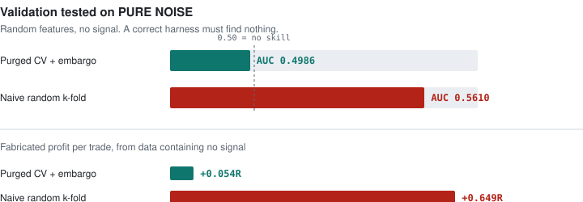
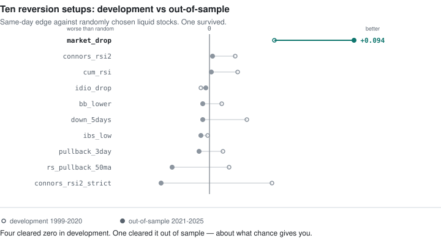
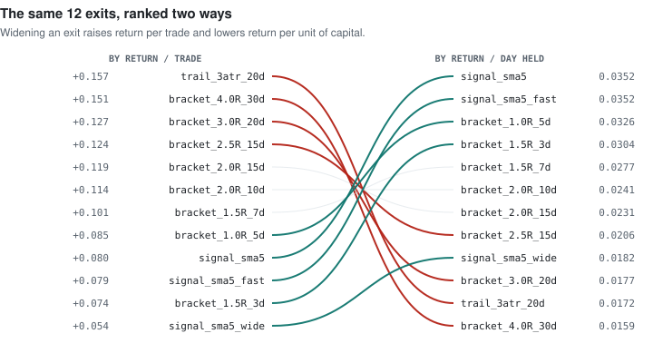

# Swing-trade statistics engine

**A quantitative study of swing-trading setups on 27 years of US equities — and an honest account of what survived.**

1,499 stocks · 7.85M daily bars · 1999–2025 · 1.78M labelled trades · 16 setups tested

The headline result is negative, and that is the point. A machine-learning layer was
built, tuned across 15 configurations, and **discarded because it did not survive
out-of-sample testing**. Three famous breakout systems were implemented to their
authors' published criteria and **lost money against a random-stock benchmark**. One
four-line rule survived, and it is now being paper-traded forward in public.

📊 **[Live monitor](https://claude.ai/code/artifact/006bb042-1d66-4c68-b9da-f3ebd2fb1060)** · 📄 **[Full findings](FINDINGS.md)**

---

## The most useful thing in this repo

Before testing any strategy, the validation harness was fed **pure random noise**.
A correct harness must find nothing in it.

<picture>
  <source media="(prefers-color-scheme: dark)" srcset="docs/figures/null-test-dark.svg">
  
</picture>

An ordinary cross-validation **invents an AUC of 0.561 and +0.65R per trade out of data
containing no signal whatsoever** — squarely inside the range people report as a
discovered edge. The cause is overlapping labels: trades that share calendar time land
on both sides of the split.

If a backtest has not been tested against noise, its results are unfalsifiable. This one
was, and `scripts/00_null_test.py` reproduces it in two minutes.

## What survived

```python
(dist_sma200_atr > 0)          # the stock's long-term uptrend is intact
& (oversold_breadth > 0.20)    # the WHOLE market is oversold, not just this name
& (resid_ret5_atr > -0.5)      # the fall is NOT specific to this company
& (rsi2 < 10)                  # a sharp short-term washout
```

Entry at the next open. Exit when the close recovers above its 5-day average, a stop one
ATR below entry, or ten sessions — whichever comes first.

| | Trades | R / trade | Same-day edge | 95% CI |
|---|---|---|---|---|
| Development 1999–2020 | 38,745 | +0.061 | **+0.042** | [+0.007, +0.079] |
| Out-of-sample 2021–2025 | 12,627 | +0.113 | **+0.094** | [+0.032, +0.157] |

"Edge" is measured against randomly chosen liquid stocks bought **on the same day** — a
benchmark that removes the market, the regime and the calendar in one step.

### How it was found is the interesting part

The obvious hypothesis is that a stock falling **on its own** should rebound hardest.
That was built first, as `idio_drop`, and it came out **negative in all twelve exit
schemes tested**.

In hindsight the reason is clear: a stock falling alone is falling for a company-specific
reason, and that reason does not resolve itself in five days. A stock falling because
*everything* is falling has no such reason attached to it. **Inverting the failed
hypothesis produced the best rule in the study.**

## What did not survive

<picture>
  <source media="(prefers-color-scheme: dark)" srcset="docs/figures/setup-survival-dark.svg">
  
</picture>

Four setups cleared zero in development. **One cleared it out of sample** — roughly what
chance produces among four marginal candidates, which is precisely why the holdout exists.

**The famous breakout systems lost money.** Minervini's volatility-contraction breakout,
O'Neil's CANSLIM pivot and Darvas boxes were implemented with the trend templates,
relative-strength ranking, base-depth and market-regime filters their authors specify,
and given a 60-day trailing stop with no profit target so winners could run. All three
**underperformed buying random liquid stocks and trailing them**, by 0.16 to 0.27R per
trade, in development and out of sample.

The one trend entry that did work was Weinstein's stage 2 — an *early* entry as price
clears a rising 30-week average, not an *extended* entry at a breakout pivot.

**Gradient boosting added nothing.** All twelve LightGBM configurations had *negative*
Brier skill — worse calibrated than a constant. A regularised logistic regression beat
every one of them, and a bucketed histogram with no ML at all beat most.

## Judge exits by capital, not by trade

<picture>
  <source media="(prefers-color-scheme: dark)" srcset="docs/figures/exit-ranking-dark.svg">
  
</picture>

Widening an exit raised return per trade **monotonically, all the way to the edge of the
search grid** — so the grid was extended, and it kept rising. The trade had quietly
stopped being mean reversion and become buy-and-hold.

Ranked by return per day of capital committed, the ordering completely inverts. Connors'
own exit rule — close above the 5-day average, ~2.2 sessions — wins once capital
recycling is counted.

## Four defences that changed conclusions

Each of these was learned the hard way here, and each one overturned a result.

1. **Purged k-fold with embargo.** Validated on noise first (above).
2. **Block bootstrap, never event-level intervals.** Trades overlap and share a market
   factor; the naive interval is **~4× too narrow**.
3. **Paired same-day benchmarks.** An earlier version measured against a *pooled*
   benchmark and overstated its result by **~15×**, because the model was concentrating
   its picks into favourable months and being scored for it.
4. **The holdout was scored once.** Every decision — features, setups, exits, model — was
   made on data up to 2020.

A fifth applies to the live results: this setup fires in **clusters**. One oversold day
can produce 180 trades sharing a single market bounce. Averaging over trades treats that
as 180 independent observations, so everything is reported **per signal day**.

## Live forward test

The rule is paper-traded forward, logged automatically each trading day. No orders are
placed. This is the only evidence nothing has contaminated.

```bash
./.venv/Scripts/python.exe scripts/13_forward_log.py --report-only
```

The report gates its own verdict on **distinct signal days**, not trades, and refuses to
draw a conclusion below 40. At ~47 active days a year, a fair reading takes about a year.

## Try it on your own setups

Each setup is a single boolean over the feature frame. Replace them in
[`src/setups.py`](src/setups.py), keep `any_liquid` as the control, and rerun:

```bash
./.venv/Scripts/python.exe scripts/02_build_events.py   # ~1 min
./.venv/Scripts/python.exe scripts/03_baseline.py       # ~1 min, kill gate
```

The control is the whole point: it tells you whether a setup beats buying something at
random. Three of the five setups in the first pass looked profitable and were **worse
than the control**.

## Setup

```bash
py -3.13 -m venv .venv                                  # 3.13 specifically
./.venv/Scripts/python.exe -m pip install -r requirements.txt
./.venv/Scripts/python.exe scripts/00_null_test.py      # validate the harness
./.venv/Scripts/python.exe scripts/01_download.py       # ~15 min
./.venv/Scripts/python.exe scripts/02_build_events.py
./.venv/Scripts/python.exe scripts/03_baseline.py
```

| Script | Purpose |
|---|---|
| `00_null_test.py` | Proves the harness finds no edge in pure noise |
| `01_download.py` | Universe (S&P 500 + 400 + 600) and 25y of daily bars |
| `02_build_events.py` | Features, setups, triple-barrier labels |
| `03_baseline.py` | Empirical baseline and kill gate |
| `10_family_models.py` | Trend vs reversion, per-family models |
| `11_reversion_lab.py` | 12 exit schemes × 10 setups |
| `12_reversion_final.py` | Final model, portfolio simulation, holdout |
| `13_forward_log.py` | Daily paper-trade logger |
| `14_build_site.py` · `15_build_figures.py` | Monitor and README figures |

`scripts/archive/` holds six superseded investigations, kept because FINDINGS.md cites
them.

## Layout

```
src/labeling.py     triple-barrier labeller  ← the primitive everything inherits
src/features.py     99 causal, stationary features
src/setups.py       setup definitions        ← edit these
src/validation.py   purged CV, CPCV, block bootstrap, null test
src/live.py         forward-test logger (paper only)
tests/              18 tests: synthetic labeller paths + live/backtest equivalence
```

`tests/test_live_matches_backtest.py` replays the live logger over history and asserts it
reproduces the study exactly — currently **3,056 trades, max |ΔR| 5×10⁻⁶**. Without that,
any live/backtest gap would be indistinguishable from a code difference.

## Limits

- **The edge is not confirmed.** The forward test is the real test and has nowhere near
  enough observations yet.
- **The holdout was read more than once** across the project's iterations. The rule was
  selected on development data before it was read, which protects it, but the published
  interval does not price in the full search.
- **Survivorship bias is present and unfixed.** The universe is current index membership,
  so delisted companies are missing. This inflates results, including the benchmark.
- **Positive in only 59% of years.** 2002, 2013 and 2018 were clearly negative.
- **Data is via `yfinance`**, which is not licensed for redistribution or commercial use.
  Fine for private research; a public deployment needs a proper vendor.

> **Not investment advice.** This is a research project documenting a statistical study.
> It reports what has happened historically under specific conditions; it does not predict
> what will happen, and the edge it describes is unconfirmed.
